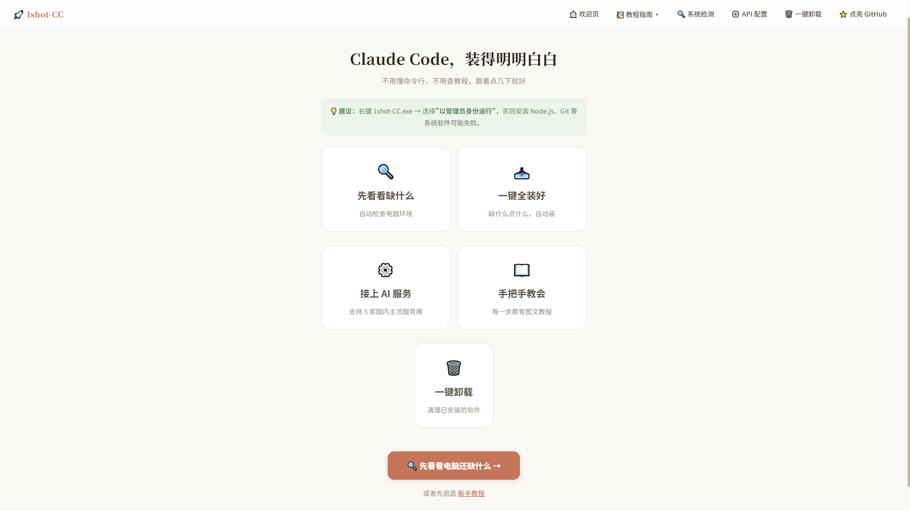
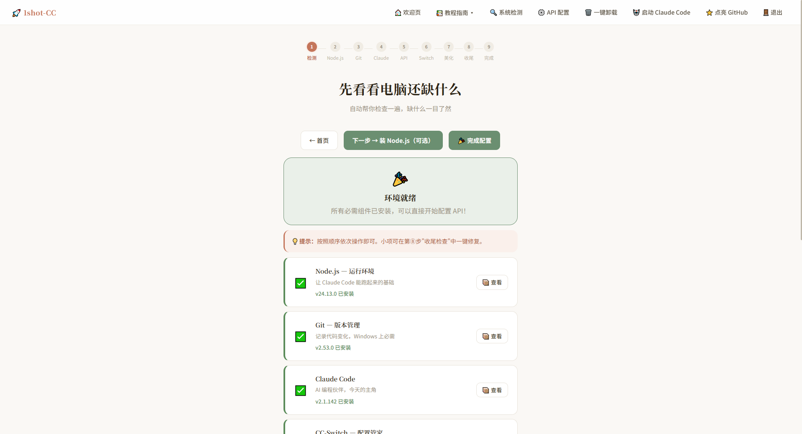
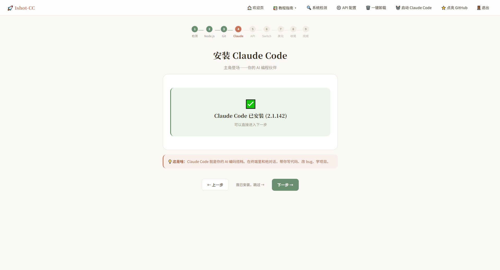
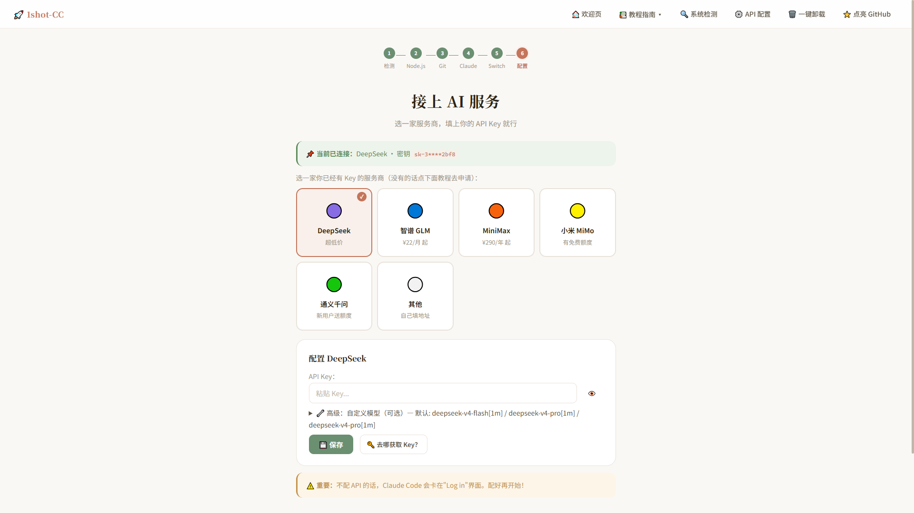
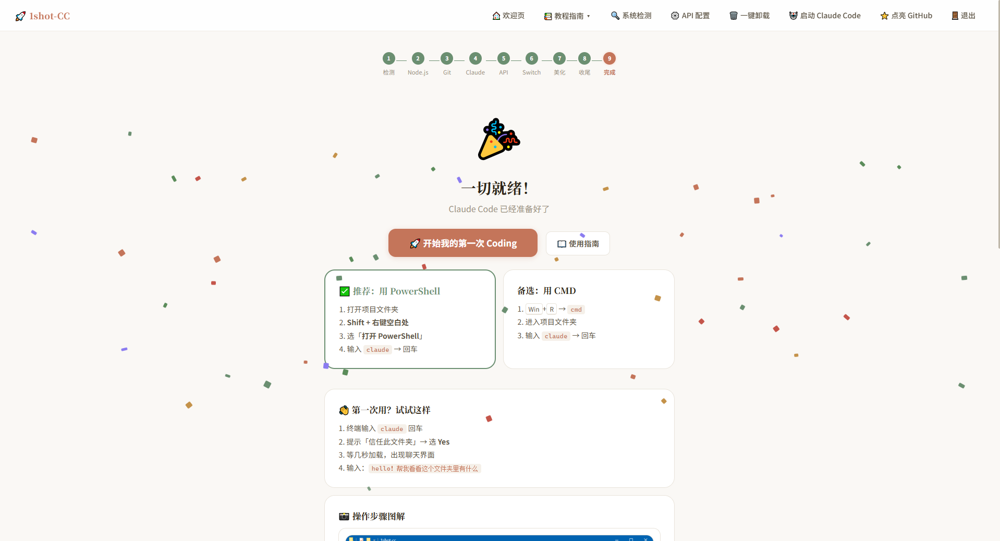
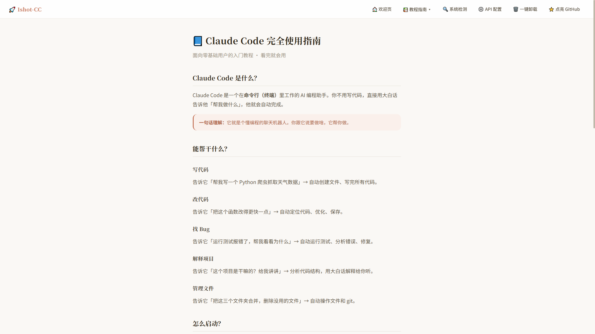
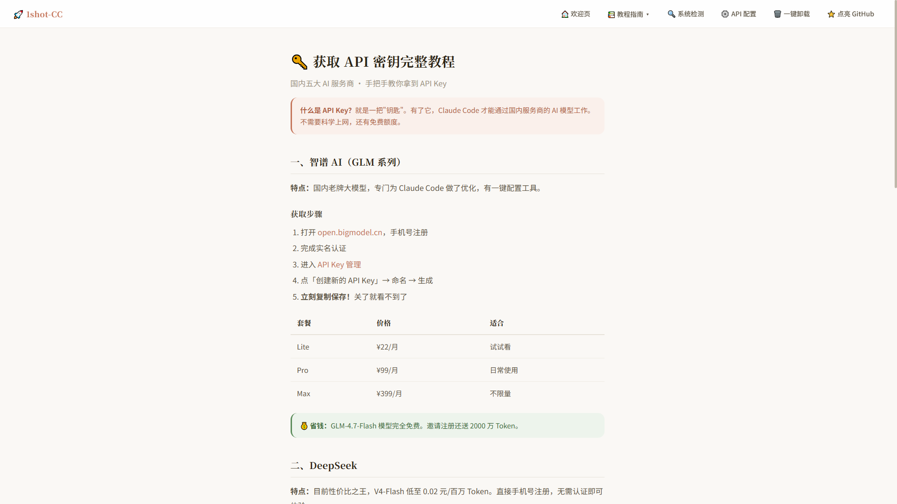
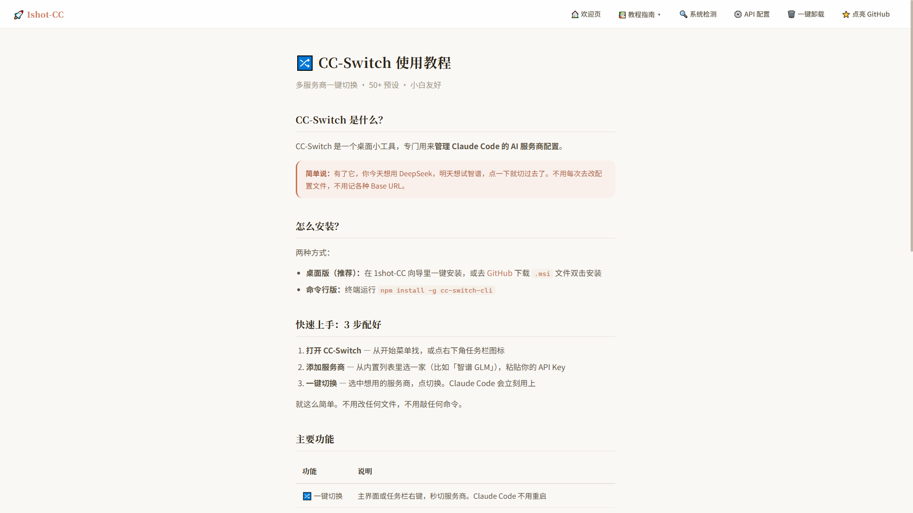
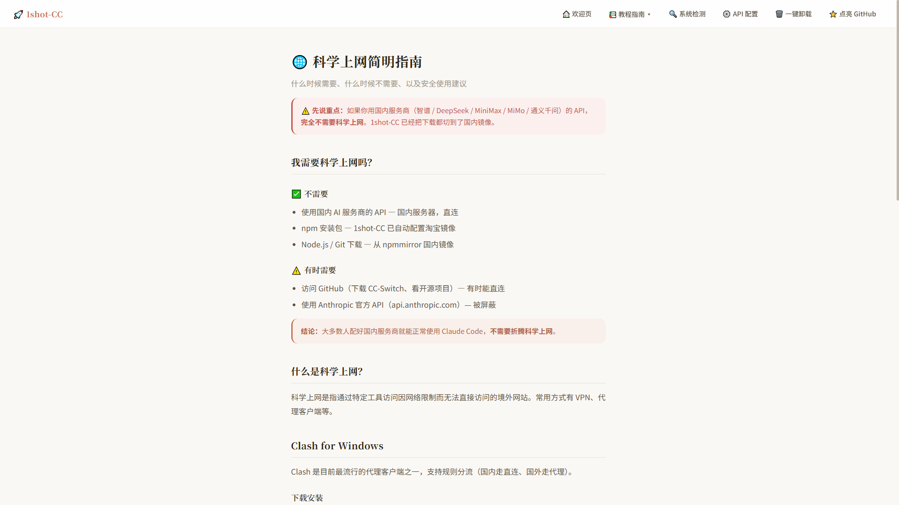
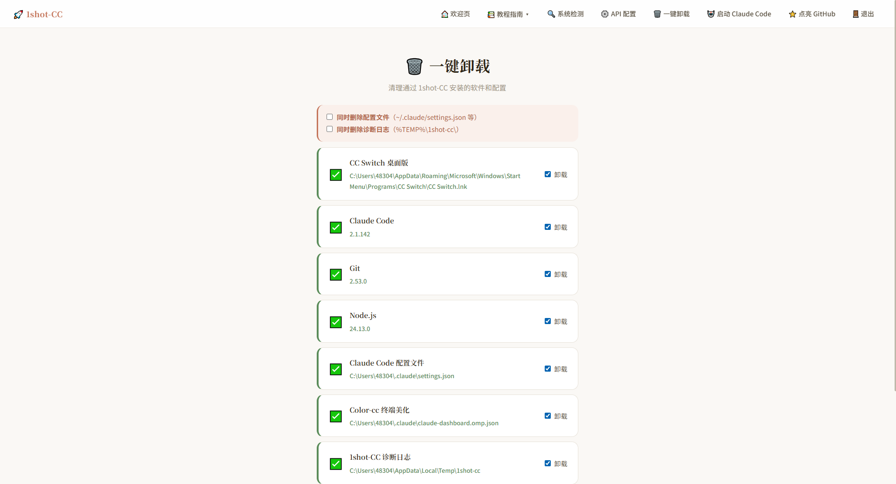

<p align="center">
  
  
  
  
</p>

<h1 align="center">🚀 1shot-CC</h1>
<p align="center"><strong>Claude Code，装得明明白白</strong></p>
<p align="center">不用懂命令行 · 不用查教程 · 跟着点几下就好</p>

---

## 💡 这是什么

**1shot-CC** 是一个 Windows 桌面向导，帮助零命令行经验的用户一键完成 Claude Code 的完整环境搭建。

第一次接触 AI 编程，看到"终端"、"npm"、"环境变量"这些词就头疼？没关系，1shot-CC 把所有的复杂步骤变成了一个接一个的按钮。点点鼠标，十分钟搞定。

| 你只需要 | 1shot-CC 帮你做 |
|---------|---------------|
| 点一下 | 自动检查电脑缺什么 |
| 再点一下 | 从国内镜像下载安装 Node.js、Git |
| 再点一下 | 装好 Claude Code |
| 填上 Key | 自动配置 AI 服务（支持 5 家国内厂商） |
| 点开始 | 打开终端，开始你的第一次 Coding |

---

## 📸 软件截图

### 1. 欢迎页
<p align="center"></p>

### 2. 首页介绍
<p align="center"></p>

### 3. 系统环境检测（第①步）
<p align="center"></p>

### 4. 一键安装 Node.js / Git / Claude Code（第②~④步）
<p align="center"></p>

### 5. API 配置（第⑤步，支持 5 家国内厂商）
<p align="center"></p>

### 6. CC-Switch + 终端美化（第⑥⑦步）
<p align="center"></p>

### 7. 收尾检查 + 完成撒花（第⑧⑨步）
<p align="center"></p>

### 8. 内置图文教程
<p align="center">
  
  
  
  
</p>

### 9. 一键卸载
<p align="center"></p>

---

## ✨ 它都能做什么

- 🧭 **9 步向导流程** — 检测 → Node.js → Git → Claude → API → Switch → 美化 → 收尾 → 完成，一条龙
- 🔍 **智能环境检测** — 13 项全方位扫描，CLI + 注册表 + 开始菜单三重回退，准确率极高
- 📥 **多层下载回退** — CC-Switch 三层回退（GitHub API → 国内加速代理 → 直连），Node.js/Git 双镜像源
- 🤖 **Claude Code 一键安装** — 自动设置执行策略、配置国内镜像、跳过 onboarding 引导
- 🔀 **CC-Switch 安装** — 桌面版和命令行版任选，安装前后自动检测环境，开始菜单智能发现
- ⚙️ **5 家国内 AI 服务商** — DeepSeek · 智谱 GLM · MiniMax · 小米 MiMo · 通义千问，支持自定义地址
- 🎨 **Color-cc 终端美化** — 官方一键命令 `irm | iex`，自动 GitHub→Gitee 回退
- 📖 **图文教程** — 4 篇完整教程，每步都有截图
- 🗑️ **一键卸载** — 卸载前自动检测环境，配置自动备份，干净利落
- 🖥️ **Windows Terminal 检测** — 自动检测并支持一键安装
- 🎯 **版本过时检测** — 全部组件版本比对，支持一键升级最新版
- 🎉 **完成页** — 撒花庆祝 + 操作步骤图解，小白也能看懂

---

## 🏁 快速开始

### 给使用者

1. 从 [Releases](../../releases) 下载 `1shot-CC.exe`
2. **右键 → 以管理员身份运行**（安装软件需要管理员权限）
3. 浏览器会自动打开欢迎页，6 秒后进入主页
4. 跟着提示一步步操作就完事了

> **提示**：所有操作都在你自己的电脑上完成，不会上传任何数据。

### 给开发者

```bash
git clone https://github.com/JananZZZ/1shot-cc.git
cd 1shot-cc
pip install flask
python main.py

# 打包为 exe
pip install pyinstaller
python -m PyInstaller build.spec --clean --noconfirm
```

---

## 📂 项目结构

```
1shot-cc/
├── main.py                      # 入口：欢迎页 + Flask 应用 + 看门狗
├── app/
│   ├── config.py                # 配置常量
│   ├── routes/                  # API 路由层
│   │   ├── api_system.py        #   系统检测 + 页面生命周期
│   │   ├── api_install.py       #   安装操作 + SSE 进度 + 卸载
│   │   ├── api_config.py        #   配置管理
│   │   └── api_tutorial.py      #   教程接口
│   ├── services/                # 业务逻辑层
│   │   ├── detector.py          #   统一检测引擎（13项 + 缓存）
│   │   ├── error_resolver.py    #   错误诊断知识库
│   │   ├── uninstaller.py       #   卸载引擎
│   │   ├── node_installer.py    #   Node.js 安装（双镜像回退）
│   │   ├── git_installer.py     #   Git 安装（双镜像回退）
│   │   ├── claude_installer.py  #   Claude Code npm 安装
│   │   ├── ccswitch_installer.py#   CC-Switch 安装（三层回退）
│   │   ├── colorcc_installer.py #   Color-cc 终端美化
│   │   ├── config_writer.py     #   settings.json 读写
│   │   ├── launcher.py          #   终端/应用启动器
│   │   └── proxy_helper.py      #   npm 镜像源工具
│   ├── utils/                   # 工具函数
│   │   ├── downloader.py        #   文件下载（进度+重试+SHA256）
│   │   ├── elevation.py         #   管理员权限检测
│   │   ├── logger.py            #   诊断日志
│   │   ├── path_helper.py       #   路径处理
│   │   ├── registry_reader.py   #   Windows 注册表读取
│   │   ├── startup_checker.py   #   启动环境检查
│   │   └── subprocess_runner.py #   子进程管理
│   └── templates/               # Jinja2 前端模板
├── static/                      # 静态资源（CSS + JS + 图片）
├── tutorials/                   # 教程 Markdown 源文件
├── assets/                      # 软件截图
├── build.spec                   # PyInstaller 打包配置
└── requirements.txt             # Python 依赖
```

---

## 🔧 技术栈

| 层 | 技术 |
|---|------|
| Web 框架 | Flask 3.x + Jinja2 |
| 前端 | Vanilla JS + CSS Custom Properties（暖白主题） |
| 实时推送 | Server-Sent Events (SSE) |
| 打包 | PyInstaller（单文件 exe，约 46MB） |
| 平台 | Windows 10/11 |
| 欢迎页 | 独立 HTTP Server + 鼠标视差动效 |

---

## 🤝 贡献

欢迎提 Issue 和 Pull Request。

- 代码风格：保持简单，函数 < 50 行，文件 < 800 行
- 错误消息：使用中文，面向小白用户
- 提交信息：使用 [约定式提交](https://www.conventionalcommits.org/zh-hans/) 格式

---

## 📄 许可证

MIT © [1shot-CC Contributors](../../graphs/contributors)

---

## ☕ 请作者喝杯咖啡

如果这个项目对你有所帮助，欢迎请作者喝杯咖啡。**0.88 元即可！**

一分也是爱 😭

<div align="center">
  <table>
    <tr>
      <td align="center" width="50%">
        <b>💚 微信</b><br><br>
        <br>
        <sub>微信扫码 → 0.88</sub>
      </td>
      <td align="center" width="50%">
        <b>💙 支付宝</b><br><br>
        <br>
        <sub>支付宝扫码 → 0.88</sub>
      </td>
    </tr>
  </table>
</div>

> 💭 以上纯属良心自发，无任何功能限制。好用的话给个 Star ⭐ 就很开心了

---

<p align="center">Made with ❤️ for everyone who wants to start coding with AI</p>
