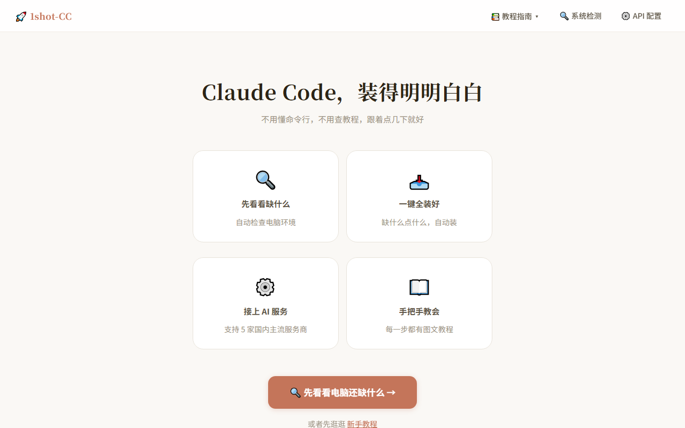
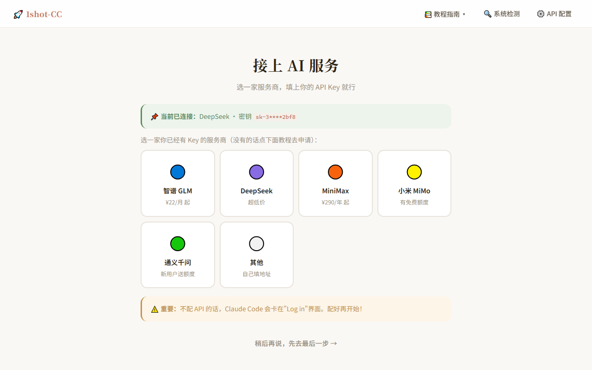
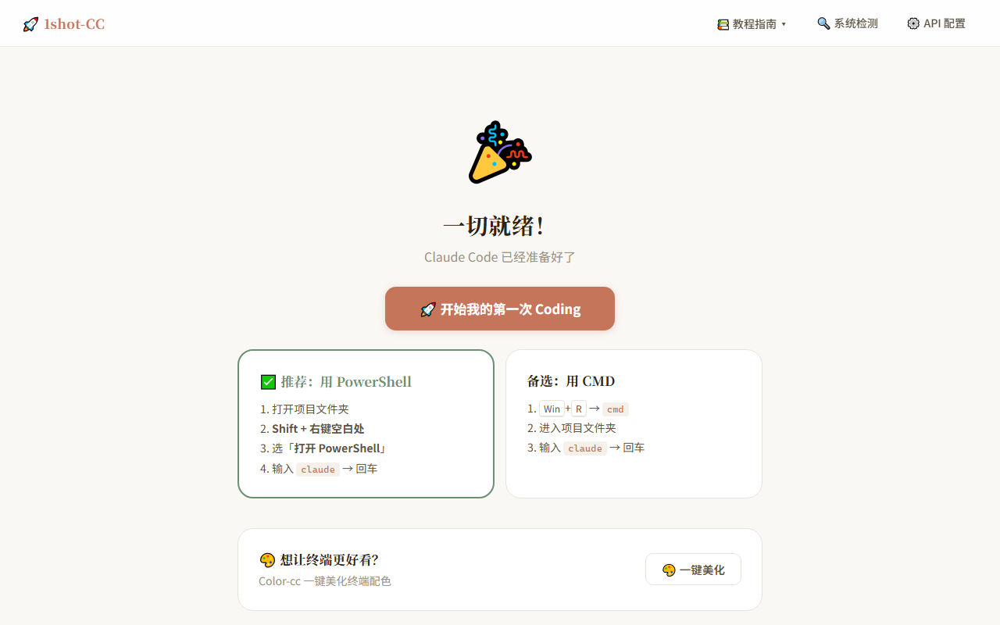
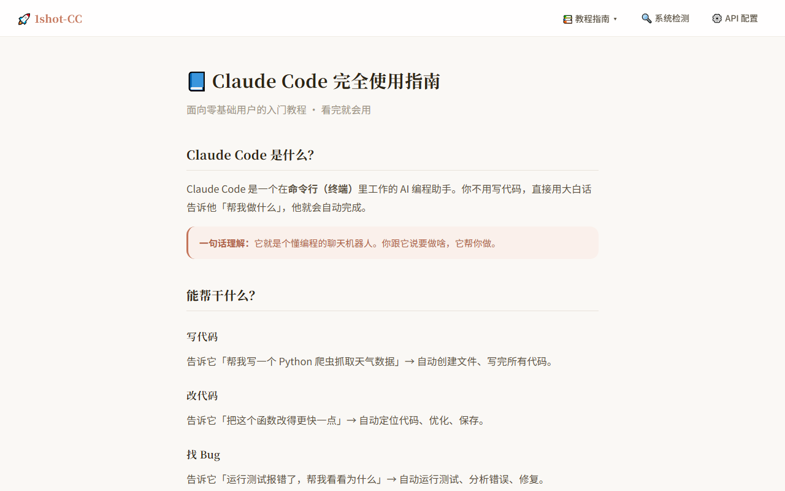
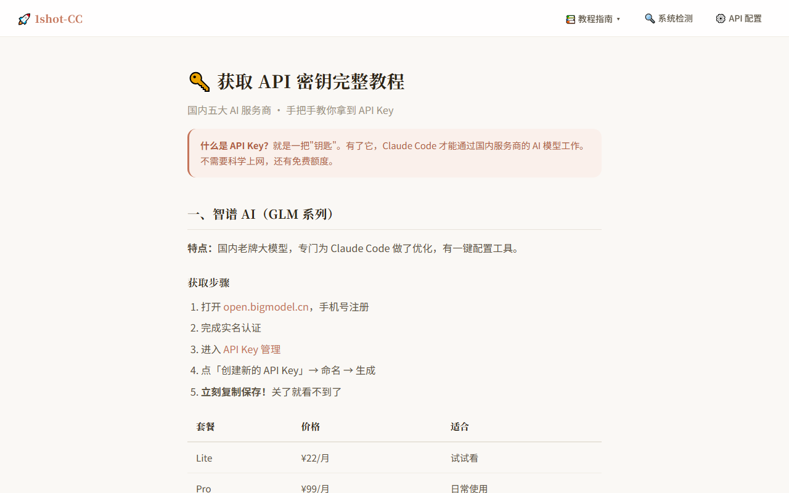
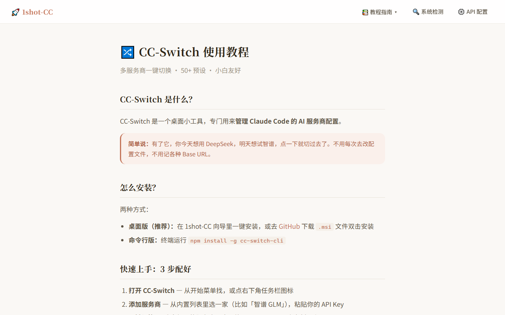
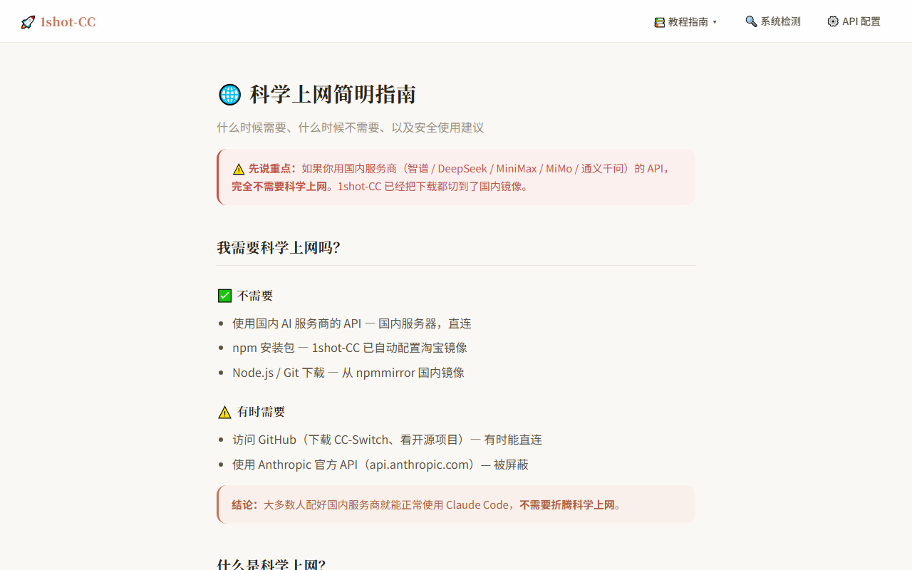

<p align="center">
  
  
  
  
</p>

<h1 align="center">🚀 1shot-CC</h1>
<p align="center"><strong>Claude Code, made effortless</strong></p>
<p align="center">No command lines · No tutorials · Just a few clicks</p>

---

## 💡 What Is This

**1shot-CC** is a Windows desktop wizard that helps users with zero command-line experience set up a complete Claude Code development environment in one go.

New to AI coding? Feel overwhelmed by words like "terminal", "npm", or "environment variables"? Don't worry — 1shot-CC turns all those complicated steps into a series of friendly buttons. Click, click, done.

| You Just | 1shot-CC Handles |
|----------|-----------------|
| Click | Automatically checks what's missing on your system |
| Click again | Downloads and installs Node.js & Git from CDN mirrors |
| Click again | Installs Claude Code globally |
| Paste your Key | Configures your AI provider (5 Chinese providers supported) |
| Click start | Opens a terminal, and you begin your first coding session |

---

## 📸 Screenshots

<p align="center">
  
  
</p>

<p align="center">
  
  
</p>

<p align="center">
  <strong>📖 Built-in Tutorials</strong>
</p>

<p align="center">
  
  
  
  
</p>

---

## ✨ Features

- 🔍 **Smart Environment Check** — One-click scan covers 9 items: Node.js, Git, PowerShell policy, npm registry, Windows Terminal, and more
- 📥 **CDN-Accelerated Downloads** — Node.js and Git installers fetched from domestic mirrors for lightning-fast speeds
- 🤖 **One-Click Claude Code** — Auto-configures execution policy, registry mirror, and skips onboarding wizard
- 🔀 **CC-Switch Integration** — Desktop or CLI version, with auto-launch and step-by-step guide after installation
- ⚙️ **5 AI Providers Built-in** — Zhipu GLM · DeepSeek · MiniMax · Xiaomi MiMo · Tongyi Qwen, plus custom API endpoint support
- 🎨 **Color-cc Terminal Theme** — One-click Oh My Posh statusline installation for a beautiful terminal experience
- 🖥️ **Windows Terminal Setup** — Detects and optionally installs Windows Terminal via winget
- 📖 **Illustrated Tutorials** — Claude Code usage, API key acquisition, CC-Switch setup, proxy guide — all with screenshots
- 🎯 **Smart Model Defaults** — Auto-fills recommended Haiku/Sonnet/Opus models per provider, with manual override
- 🎉 **Confetti Celebration** — A cheerful finishing page that launches Claude Code in Windows Terminal with one click

---

## 🏁 Quick Start

### For Users

1. Download `1shot-CC.exe` from [Releases](../../releases)
2. Double-click to run (Windows may show a security warning — click "More info → Run anyway")
3. Your browser will open the wizard automatically
4. Follow the prompts — that's it!

> **Note**: The wizard runs entirely on your local machine. No data is ever uploaded.

### For Developers

```bash
# Clone the repo
git clone https://github.com/farion1231/1shot-cc.git
cd 1shot-cc

# Install dependencies
pip install flask

# Start dev server
python main.py

# Build exe
pip install pyinstaller
python -m PyInstaller build.spec --clean --noconfirm
# Output: dist/1shot-CC.exe
```

---

## 📂 Project Structure

```
1shot-cc/
├── main.py                      # Entry: Flask app + auto-open browser
├── app/
│   ├── config.py                # Constants (versions, download URLs, providers)
│   ├── routes/                  # API route layer
│   │   ├── api_system.py        #   System check endpoints
│   │   ├── api_install.py       #   Install operations + SSE progress
│   │   ├── api_config.py        #   Config management endpoints
│   │   └── api_tutorial.py      #   Tutorial endpoints
│   ├── services/                # Business logic layer
│   │   ├── node_installer.py    #   Node.js download & install
│   │   ├── git_installer.py     #   Git download & install
│   │   ├── claude_installer.py  #   Claude Code npm install
│   │   ├── ccswitch_installer.py#   CC-Switch download & install
│   │   ├── config_writer.py     #   settings.json read/write
│   │   ├── launcher.py          #   Terminal/app launcher (WT preferred)
│   │   ├── colorcc_installer.py #   Color-cc terminal theming
│   │   └── proxy_helper.py      #   npm registry helpers
│   ├── utils/                   # Utility functions
│   │   ├── downloader.py        #   File downloader (progress + retry)
│   │   ├── path_helper.py       #   Path utilities
│   │   ├── registry_reader.py   #   Windows registry reader
│   │   └── subprocess_runner.py #   Subprocess management
│   └── templates/               # Jinja2 frontend templates
├── static/                      # Static assets (CSS + JS)
├── tutorials/                   # Tutorial markdown sources
├── screenshots/                 # App screenshots
├── build.spec                   # PyInstaller config
└── requirements.txt             # Python dependencies
```

---

## 🔧 Tech Stack

| Layer | Technology |
|-------|-----------|
| Web Framework | Flask 3.x + Jinja2 |
| Frontend | Vanilla JS + CSS Custom Properties (light & dark themes) |
| Real-time Updates | Server-Sent Events (SSE) |
| Packaging | PyInstaller (single exe, ~13MB) |
| Platform | Windows 10/11 |

---

## 🤝 Contributing

Issues and pull requests are welcome!

If you find a bug or have an idea to make this tool better, please [open an Issue](../../issues/new).

Before contributing:
- Keep it simple — functions under 50 lines, files under 800 lines
- Error messages should be user-friendly (Chinese for end-user facing strings)
- Use [Conventional Commits](https://www.conventionalcommits.org/) for commit messages

---

## 📄 License

MIT © [1shot-CC Contributors](../../graphs/contributors)

---

## ☕ Buy Me a Coffee

If this project has been helpful to you, consider buying the author a coffee. **Just ¥0.88!**

Every bit of support helps offset the tokens burned during development 😭

<div align="center">
  <table>
    <tr>
      <td align="center" width="50%">
        <b>💚 WeChat</b><br><br>
        <br>
        <sub>Scan with WeChat → ¥0.88</sub>
      </td>
      <td align="center" width="50%">
        <b>💙 Alipay</b><br><br>
        <br>
        <sub>Scan with Alipay → ¥0.88</sub>
      </td>
    </tr>
  </table>
</div>

> 💭 This is completely voluntary — no features are locked behind payment. A ⭐ Star means just as much!

---

<p align="center">Made with ❤️ for everyone who wants to start coding with AI</p>
